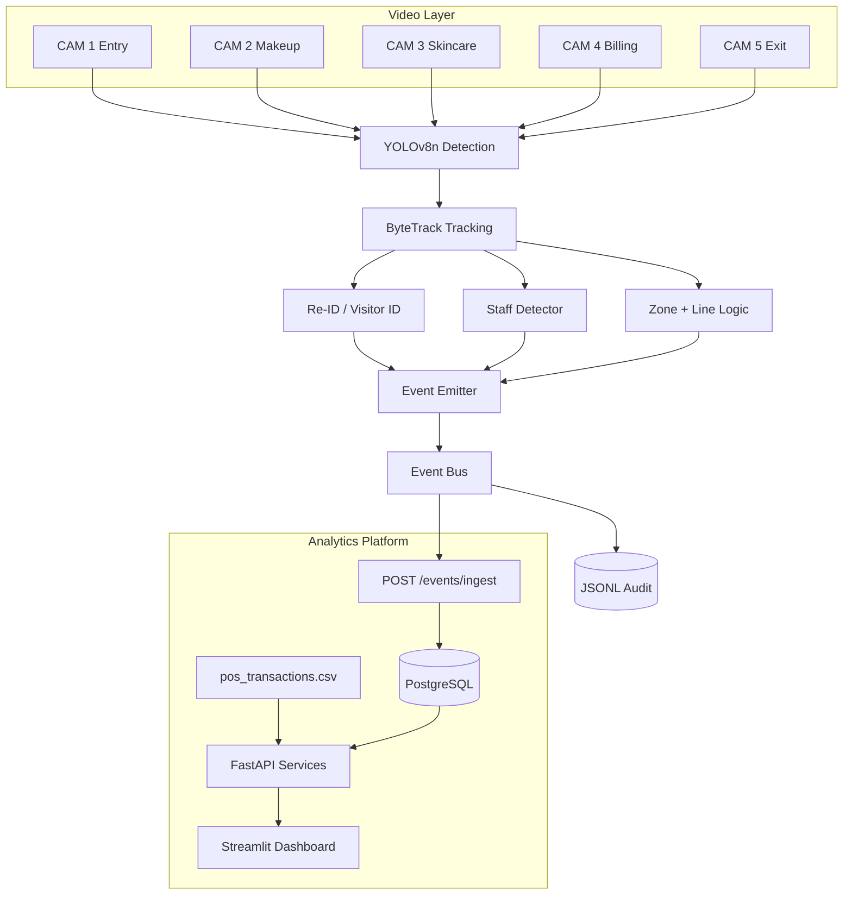
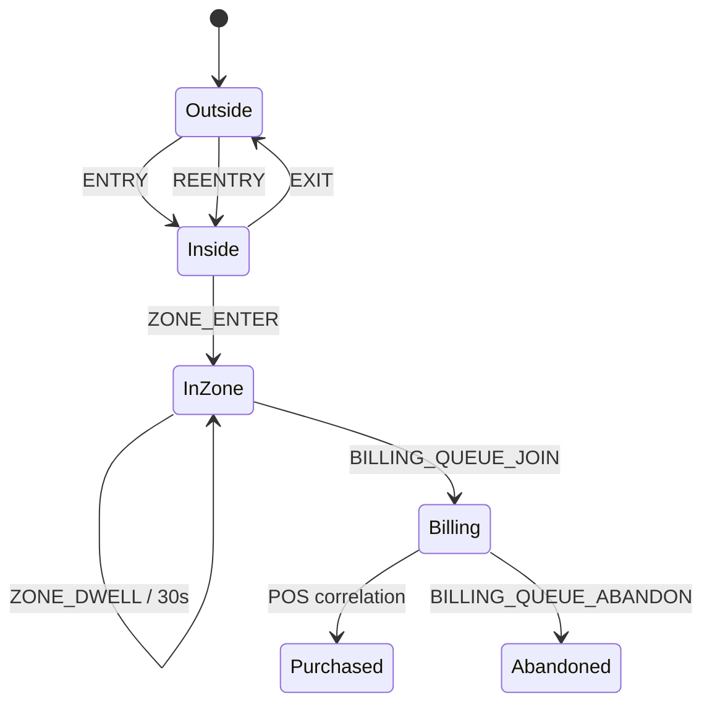

# System Design — Store Intelligence Platform

## System overview

The Store Intelligence Platform is an **event-driven retail analytics system** that converts heterogeneous store signals—CCTV video and point-of-sale (POS) transactions—into a unified timeline of visitor behavior. The design goal is not maximal detection accuracy in isolation, but a **working end-to-end path** from raw MP4 files to business questions such as: How many unique shoppers entered? What fraction converted? Which zones are cold? Is the billing queue backing up?

The system is deliberately modular: computer vision runs as an **offline or batch edge job**, while analytics run as a **stateless API tier** backed by a relational database. This separation mirrors production deployments where inference GPUs are scarce but API replicas are cheap.

---

## Architecture diagram

See also: `assets/architecture.mmd`, `assets/event_flow.mmd`, `assets/database_schema.mmd`.

---

## Data flow

1. **Ingest video frames** at configurable stride (`FRAME_STRIDE`) to balance CPU cost vs temporal resolution.
2. **Detect persons** with YOLOv8n (class 0), output normalized bounding boxes.
3. **Track** detections with ByteTrack; maintain `track_id` per camera stream.
4. **Map geometry**: centroid tested against zone polygons; trajectory tested against virtual lines.
5. **Assign visitor_id**: new ID per track unless Re-ID matches a recently exited visitor (REENTRY).
6. **Classify staff** using uniform colors and long multi-zone dwell; set `is_staff=true`.
7. **Emit events** to internal bus → append JSONL → optional HTTP ingest.
8. **Persist** validated events; update **sessions** on entry/exit boundaries.
9. **Serve analytics** on read path; join POS for conversion attribution.

---

## Detection layer

**Model:** Ultralytics YOLOv8n pretrained on COCO.

**Rationale:** Nano variant achieves real-time-ish performance on CPU for 1080p sampled frames—critical for challenge reproducibility without mandating NVIDIA GPUs.

**Configuration:**

- `classes=[0]` (person only)
- Confidence threshold ~0.35 (tunable via env)
- IOU 0.5 for NMS

**Output:** `Detection(bbox_xyxy_normalized, confidence)`.

**Failure modes:** occlusion, partial person at frame edge, reflections. Mitigated by temporal tracking smoothing, not single-frame perfection.

---

## Tracking layer

**Algorithm:** ByteTrack via `supervision` library.

**Why ByteTrack:** Strong association between low- and high-confidence detections; widely adopted; simple integration with YOLO outputs.

**Persistent IDs:** `track_id` integer per camera independent until mapped to `visitor_id`.

**State:** Track history stores recent centroids for line-crossing direction tests.

---

## Session management

Sessions represent **shopping visits**, not tracks.

| Event | Session effect |
|-------|----------------|
| ENTRY / REENTRY | Create session if none open |
| ZONE_ENTER | Append `zones_visited` |
| BILLING_QUEUE_JOIN | `queue_joined=true` |
| EXIT | Set `ended_at` |
| POS match | `converted=true`, `purchased=true` |

Staff sessions may exist in DB but are filtered from funnel/metrics queries (`is_staff=false`).

**No double counting:** Funnel stages use distinct visitor_id sets intersected stage-by-stage.

---

## Event lifecycle

**Canonical types:** `ENTRY`, `EXIT`, `REENTRY`, `ZONE_ENTER`, `ZONE_EXIT`, `ZONE_DWELL`, `BILLING_QUEUE_JOIN`, `BILLING_QUEUE_ABANDON`.

**Schema fields:** `event_id` (UUID4), `store_id`, `camera_id`, `visitor_id`, `event_type`, `timestamp` (UTC ISO), `zone_id`, `dwell_ms`, `is_staff`, `confidence`, `metadata` (JSON).

---

## API layer

**Framework:** FastAPI 0.110+

**Endpoints:**

| Method | Path | Purpose |
|--------|------|---------|
| POST | `/events/ingest` | Batch ingest ≤500 |
| GET | `/metrics`, `/stores/{id}/metrics` | KPIs |
| GET | `/stores/{id}/funnel` | Session funnel |
| GET | `/stores/{id}/heatmap` | Zone intensities |
| GET | `/stores/{id}/anomalies` | Operational alerts |
| GET | `/health` | Liveness + feed freshness |

**Cross-cutting:**

- Pydantic validation at boundary
- `RequestLoggingMiddleware`: `trace_id`, `latency_ms`, `status_code`
- Global exception handler → JSON error, no stack leak
- DB down → HTTP 503 with structured body

---

## Database design

**ORM:** SQLAlchemy 2.x

**Tables:**

1. **events** — append-only fact table; unique `event_id`
2. **sessions** — derived visitor visits; conversion flags
3. **metrics** — optional snapshot cache (extensible)

**Deployments:**

| Environment | URL |
|-------------|-----|
| Local dev | SQLite file |
| Docker | PostgreSQL 16 |

Indexes on `store_id`, `visitor_id`, `event_type`, `timestamp` for analytics queries.

---

## Anomaly detection logic

Rule-based engine (interpretable for reviewers):

| Type | Trigger | Severity |
|------|---------|----------|
| QUEUE_SPIKE | `queue_depth≥5` or many recent queue joins | high/medium |
| CONVERSION_DROP | conversion_rate < 5% with ≥5 visitors | high |
| DEAD_ZONE | zone frequency < 20% of average | medium |

Each returns `suggested_action` string for store ops.

---

## Dashboard architecture

**Stack:** Streamlit polling `httpx` → FastAPI.

**Widgets:** KPI metrics, funnel bar chart, heatmap table/chart, anomaly cards, health strip.

**Refresh:** Manual by default; optional auto-refresh interval to avoid evaluator CPU spin.

---

## Scaling strategy

### Target: 40 stores × 3 cameras = 120 streams

| Layer | Today | Future |
|-------|-------|--------|
| Inference | Batch per store nightly | K8s Jobs + GPU node pool per region |
| Transport | HTTP ingest batches | Kafka topics partitioned by `store_id` |
| Storage | PostgreSQL | Postgres + read replicas; event archival to S3 |
| API | Single Uvicorn | HPA on CPU/latency; Redis cache for hot metrics |
| Dashboard | Streamlit | React + WebSocket fanout |

### Migration path

1. **SQLite → PostgreSQL** — change `DATABASE_URL` only; SQLAlchemy abstracts dialect.
2. **PostgreSQL → Kafka** — pipeline producers write to `store.events.v1`; API consumers idempotently persist.
3. **Kafka → Kubernetes** — Helm chart: `api`, `consumer`, `pipeline-worker`, `postgres`, `kafka` (Strimzi).

**Ordering guarantees:** partition key = `store_id` + `camera_id` preserves per-camera sequence.

---

## Assumptions

1. Camera polygons and virtual lines are **normalized 0–1** coordinates in `store_layout.json`.
2. Brigade layout XLSX is visual-only; zones inferred from retail semantics.
3. Recording date **2026-04-10** anchors frame timestamps.
4. POS conversion: visitor in `billing` or `billing_queue` within **5 minutes before** transaction time.
5. Staff have no ground-truth labels; heuristics approximate Purplle uniform colors.

---

## Limitations

- Cross-camera identity fusion is partial (Re-ID on re-entry, not global gallery).
- Entry counts depend on virtual line calibration.
- CPU pipeline is slow on full videos without `MAX_FRAMES_PER_VIDEO`.
- OSNet weights optional; histogram fallback less robust.
- Anomalies are rule-based, not ML.

---

## AI-assisted decisions

| Topic | AI suggestion | Decision | Reason |
|-------|---------------|----------|--------|
| Detector | YOLOv8s for accuracy | **YOLOv8n** | CPU-feasible for reviewers |
| Tracker | DeepSORT | **ByteTrack** | Simpler, strong MOT benchmarks |
| Schema | CloudEvents envelope | **Flat JSON** | Direct DB mapping |
| API | Flask | **FastAPI** | Pydantic + OpenAPI auto docs |
| Staff | Train classifier | **Heuristics** | No labels in dataset |
| Re-ID | Always OSNet | **OSNet optional** | Graceful fallback |
| Ingest | Kafka immediately | **HTTP + JSONL** | Challenge scope fit |

**Rejected:** End-to-end transformer tracking (complexity), hardcoded metric JSON (integrity fail), single global visitor counter (breaks group entry requirement).

---

## Security & privacy (production notes)

- No facial recognition storage; embeddings not persisted in challenge build.
- PII in POS not exposed via API—only aggregated metrics.
- AuthN/Z would wrap `/events/ingest` in production (API keys per store).

---

## Observability

- Structured JSON logs per HTTP request.
- Health endpoint exposes `stale_feed`, `last_event_timestamp`.
- `scripts/verify_evaluation.py` automates acceptance gate.

This design prioritizes **clarity, reproducibility, and business relevance** over benchmark leaderboard scores—a direct response to the challenge evaluation philosophy.
